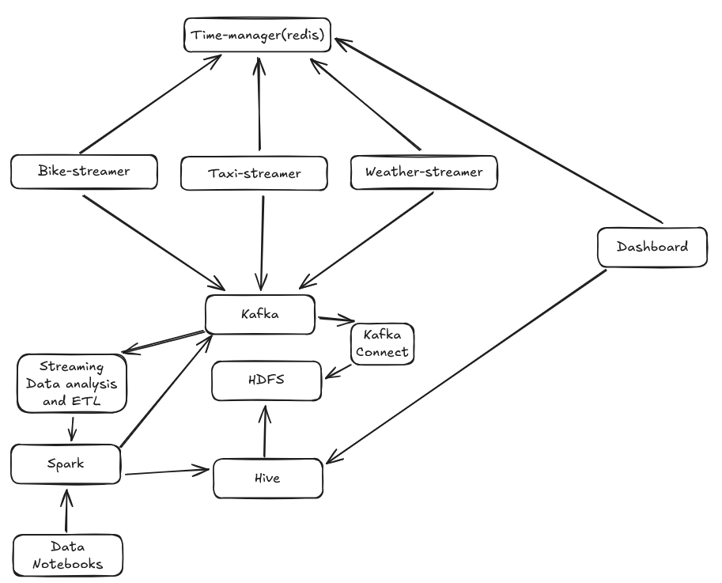

<h1>Boston Transport Department</h1>
<h2>The Objective</h2>

The project is apart of a 10 ECTS Course of Big Data and Science Technologies (E25). 
The objective with this course is to work different datasets where they overlap eachtother and thereby finding something valuable for the Customer.
Our main objective is to study the relationsship between transportation and weather.
Please note, that this project is also a part of our Scientific Methods Course (E25), where we will have a more theoretical approach there.

<h2>Who is our Customer</h2>

Our Customer in this context is the Boston Transportation Department, since we are working with datasets of weather reports from different weather stations in Bostom City.

<h2>How is our Architecture Structured?</h2>

The following image shows how we have structured our image.

