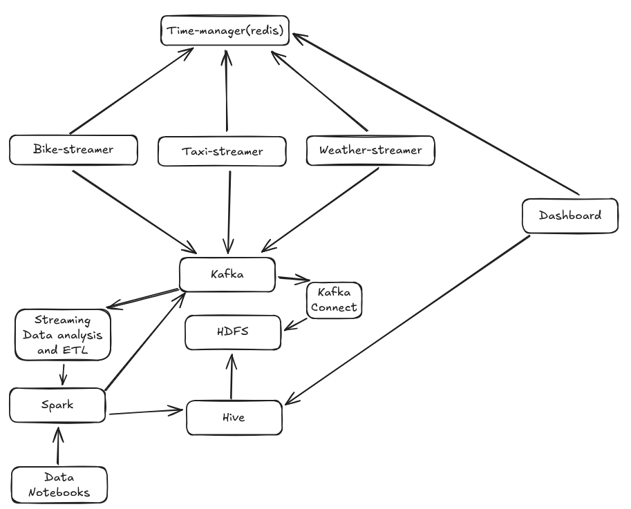

# Boston Transport Department

## The Objective
The project is apart of a 10 ECTS Course of Big Data and Science Technologies (E25). 
The objective with this course is to work different datasets where they overlap eachtother and thereby finding something valuable for the Customer.
Our main objective is to study the relationsship between transportation and weather.
Please note, that this project is also a part of our Scientific Methods Course (E25), where we will have a more theoretical approach there.

## Who is our Customer
Our Customer in this context is the Boston Transportation Department, since we are working with datasets of weather reports from different weather stations in Bostom City.

## How is our Architecture Structured?
The following image shows how we have structured our image.

## Getting started
To run this project you need the following:
- A kubernetes cluster, with a given kubeconf location and context(default is `~/.kube/config"` and `docker-desktop` context)
- Installed uv, kubectl and terraform

Then run the following to create the services:
- `cd infra/environments/local`
- `terraform init`
- `terraform apply`

To forward the relevant ports to your local machine, use the `tools/forward-all.py` script:
- Start by running `uv sync` to install all the dependencies.
- Then execute `uv run tools/forward-all.py`

## Connect VSCode to jupyter kernel
1. Open a notebook and click on the kernel icon in the top right corner.
2. Click "Select another kernel..."
3. Click "Existing Jupyter server"
4. Enter the URL `http://localhost:8080/`
5. Type the token `adminadmin`
6. Click "Select Kernel"
Now you can run the notebook and it will connect to the jupyter kernel.
